# References — Playwright Deep-Pass

Capture date: 2026-05-11
Viewport: 1440x900
Method: Live navigation via Playwright; full-page screenshots; computed styles read from `getComputedStyle()`; product card HTML extracted from live DOM.

---

## topfits.com

**Status**: live (Cloudflare challenge auto-resolves in ~8s)
**Blockers dismissed**: Cloudflare turnstile (waited 8s, no further interaction)
**Pages captured**: home, shop, converter

### Visual fingerprint
- Theme: **dark**, body bg `#000000`, text `#ffffff`
- Display font: `Outfit` (weights 500/700/900). Body font: `Inter`. Mono: `Space Mono`. All hosted on fonts.googleapis.com via a single combined CSS2 request.
- H1 is 64px, all-caps, ultra-bold. Nav is sticky on a solid `#000000` bar.
- Accent pink/red `#ff0055` for "TOP SELLER" badges; blue `#3b82f6` for "QC" badges; black/white otherwise.

### Layout breakdown
- **Hero**: full-width black; oversized headline "THE BEST PLACE TO FIND LITBUY REPS". Sticky preferences modal opens on first visit (Currency / Language(beta) / Agent / Grid Density chips with flag emojis).
- **Sections in order**: hero -> "Trending >" product strip -> category strips -> footer.
- **Footer**: dark, minimal.

### Product card anatomy
- Image aspect: **4:5**, white bg `#fff`, inside a `#000` card with 14px radius and 1px `#222` inner border.
- Info shown: title, two-currency price (USD + CNY), "TOP SELLER" pill, "QC" pill, wishlist heart top-right.
- Hover effect: subtle scale (animate-on-scroll + .is-visible fade in).
- CTA: implicit (whole card linkable). No visible "Buy" button on the card itself.

### Features inventory
- [x] Link converter (`/converter/`) — supports ACBuy, AllChinaBuy, KakoBuy, etc.
- [x] Currency switcher (USD/EUR/GBP/CNY in preferences modal)
- [ ] Search w/ fuzzy — no traditional search bar; but has **Visual Search** page (image upload)
- [x] Category strip / pills (Tops / Bottoms / etc.)
- [ ] Floating side widget
- [ ] Sales notification popup
- [x] Preferences modal pops on first visit
- [x] Account system (Discord OAuth — `/accounts/discord/login/`)
- [ ] QC photo gallery / lightbox
- [ ] Weight estimator
- [ ] Browser extension promo
- [x] Affiliate code support (agent picker in converter)
- [ ] Command palette
- [ ] Infinite scroll (no pagination found either — likely virtualized grid)
- [x] Filter UI (Sort By / Price / category)
- [x] Wishlist (`/wishlist/`)
- [x] Outfits page
- [x] Videos page
- [x] **Visual search** (image upload)

### Tech stack hints
- Generator meta: none. Likely **Django** (URL trailing slashes, allauth pattern `/accounts/discord/login/`).
- Fonts via Google Fonts. CDN: Cloudflare (challenge + `/cdn-cgi/rum?` beacon).
- 350 `<a>` elements on home — heavy nav + duplicate mobile menu.

### Worth stealing
1. The preferences modal as first-touch with **flag-emoji currency cards** (`🇺🇸`) is a clean UX. See `references/screenshots/topfits/home.png`.
2. **Visual search by image upload** — unique among the 16 sites.
3. Color-pill badge stack (`TOP SELLER` magenta + `QC` blue, mono font 0.6rem) on cards is a strong information density pattern. See `references/screenshots/topfits/shop.png`.
4. Compact converter UI with agent radio + "CONVERT ->" arrow CTA. See `references/screenshots/topfits/converter.png`.

### Skip / dated
- Too many duplicate nav links (350 total `<a>` — mobile/desktop nav both rendered) blocks accessibility.
- Inline styles on every product card (no class system) — replicating this without a templating engine = nightmare.

### Screenshots
- 
- 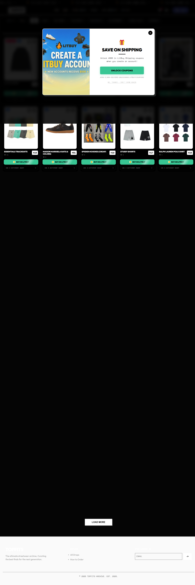
- 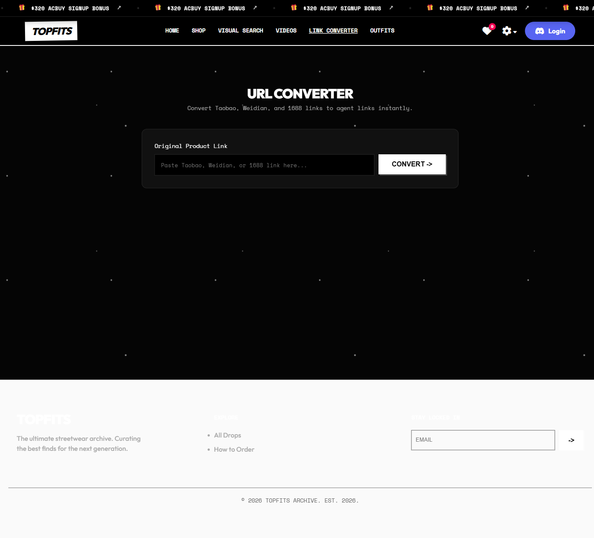

---

## finds.cx

**Status**: live, no blockers
**Blockers dismissed**: none
**Pages captured**: home (which is the Link Converter), shop (`/home.html`), converter (same as home)

### Visual fingerprint
- Theme: **dark**, body bg `#0a0e17` (deep navy-black), nav `#131a2a`, text `#ffffff`.
- Font: system stack (`Segoe UI, Tahoma, Geneva, Verdana, sans-serif`). No Google Fonts loaded. Reads as a static HTML site.
- H1 32px (not punchy). No accent color in the global theme — relies on illustration buttons.

### Layout breakdown
- **Hero**: the home page IS the link converter. Headline "Link Converter", paste textbox, big button.
- "Finds" page (`/home.html`) is the catalog — grid of product cards, no hero.

### Product card anatomy
- Image aspect: **1:1** (square thumbnails).
- Info shown: title, **dual-currency price `$59.85, ¥430.92`**, "View Item" buy button, "Save" link button, heart icon top-right of image.
- Buy CTA links directly to KakoBuy with `?affcode=ginoreps` affiliate query.
- All product images proxied through `si.geilicdn.com` (Weidian's CDN) — so images embed Weidian/1688 imagery directly.

### Features inventory
- [x] Link converter (homepage itself)
- [ ] Currency switcher (none — just shows USD+CNY together)
- [ ] Search w/ fuzzy
- [ ] Category strip / pills
- [ ] Floating side widget
- [ ] Sales notification popup
- [ ] Newsletter popup
- [ ] Account system
- [ ] QC photo gallery
- [ ] Weight estimator
- [ ] Browser extension
- [x] Affiliate hardcoded into every "Buy" link (`affcode=ginoreps`)
- [ ] Command palette
- [x] Infinite scroll likely (no paginator)
- [x] Discord pinned in nav (link to `discord.gg/QPavf82AMf`)
- [x] How to Buy page
- [x] Save/wishlist (client-side based on data-product-id)

### Tech stack hints
- Static HTML / vanilla JS. No framework markers (no `#__next`, no Shopify, no generator meta).
- Only third-party script: Cloudflare Insights beacon.
- "Kakobuy Giveaway" h2 on home indicates community-promotion landing pattern.

### Worth stealing
1. **Converter-as-homepage** — eliminates one click for the primary use case. See `references/screenshots/finds-cx/converter.png`.
2. **Dual-currency price display** ($59.85, ¥430.92) baked into the card instead of via switcher. Lower-friction. See `references/screenshots/finds-cx/shop.png`.
3. Hardcoded `affcode` in every buy link — a reminder to centralize affiliate codes in a template helper.

### Skip / dated
- System font stack feels 2008. We should still pick a typeface.
- Single navy palette is monotone — needs an accent.

### Screenshots
- 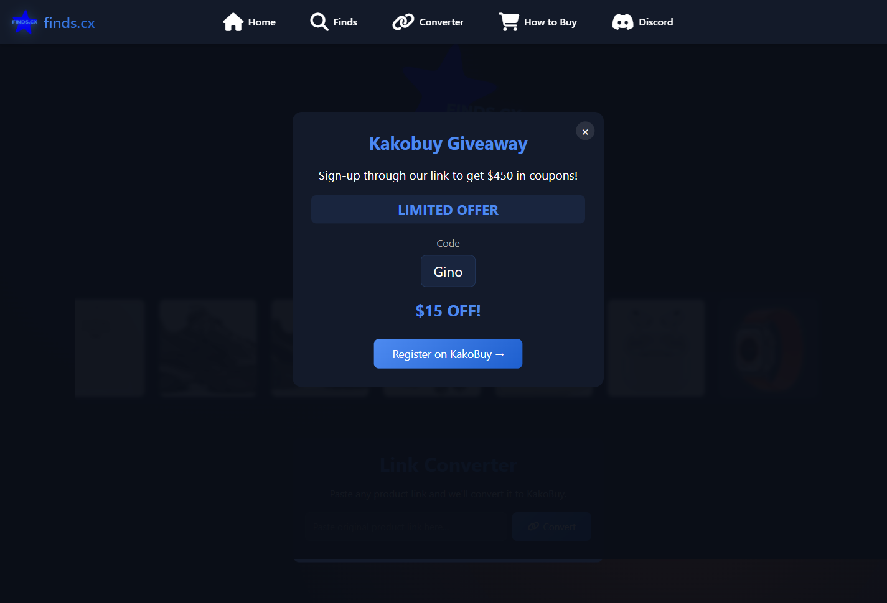
- 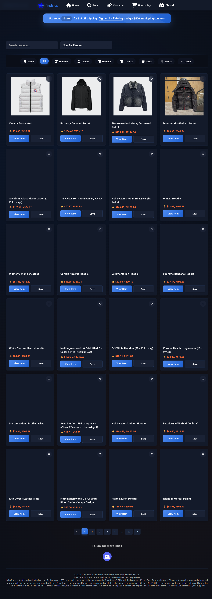
- 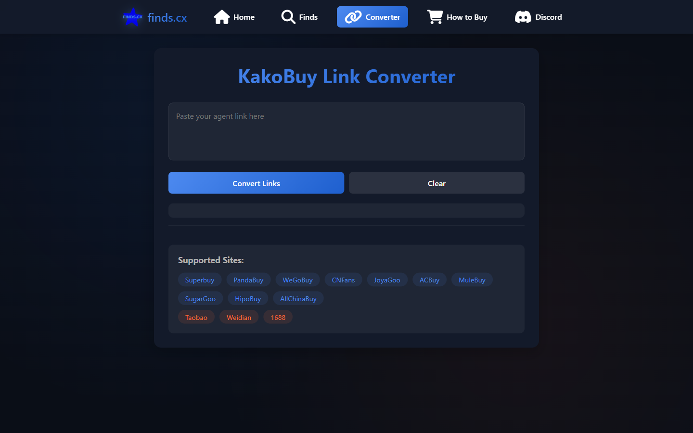

---

## doppel.fit

**Status**: live, no blockers
**Blockers dismissed**: none (cookie banner doesn't auto-show)
**Pages captured**: home, tutorial (`/how-to-cop`). `/finds` and `/converter` SPA-redirect to `/`.

### Visual fingerprint
- Theme: **light** by default with dark mode toggle. Body bg `#ffffff`, text `#111827` (Tailwind slate-900).
- Font: **Inter** (variable, both italic + roman, opsz 14..32, wght 100..900) + **Instrument Serif** for accents. Hosted on Google Fonts.
- H1 48px, **two-line headline with vertical spacing trick**: "Discover more / Pay less" — first line in sans + second line in serif italic on real site (confirmed `Instrument+Serif:ital@0;1` font request).
- Cards have 18px rounded radius, soft `outline-1 outline-white/50 dark:outline-neutral-800` ring. Pill bg uses Tailwind neutral palette.

### Layout breakdown
- **Hero**: clean wordmark + tagline + masthead grid.
- Section order: Popular -> New -> Outfits -> Sellers -> Shoes -> Tops -> Bottoms -> Outerwear (curated rails by category).
- Cards stack vertically on mobile, 4-col on desktop. Each card has a small **avatar cluster top-right** ("+16 variants") with two stacked seller-image circles + a count badge. Very distinctive.

### Product card anatomy
- Image aspect: **1:1** (`aspect-square`).
- The card top-right shows a tiny pill `bg-white dark:bg-neutral-700 backdrop-blur-md` with **two overlapping mini-thumbs of variants** and a `+16` counter.
- Hover/cross-fade effect: `class="cross-fade-image svelte-xw2oga active"` — image rotates through multiple variants automatically.
- Wishlist heart not visible by default; primary action is click-into-product.

### Features inventory
- [x] Link converter (Discord Bot is the actual public-facing tool — "How to cop", "Discord Bot" in nav)
- [ ] Currency switcher (USD/EUR present in DOM but minimal UI)
- [x] Search (Doppel is fundamentally a discovery feed + QC finder)
- [x] Category rails (Popular/New/Outfits/Sellers/Shoes/Tops/Bottoms/Outerwear)
- [ ] Floating side widget
- [x] Newsletter popup likely (Affiliate Programme nav link)
- [x] Account system implied (FAQ + How to cop pages)
- [x] QC photo gallery (the whole site is a QC finder)
- [ ] Weight estimator
- [ ] Browser extension
- [x] Affiliate Programme page (visible in nav)
- [ ] Command palette
- [x] Variant carousel auto-cross-fade in card (Svelte component)
- [x] Dark/light mode (Tailwind `dark:` classes throughout)
- [x] Discord Bot promo
- [x] Blog

### Tech stack hints
- **SvelteKit** (Svelte component class names visible: `svelte-xw2oga`).
- Tailwind CSS (clear from utility classes like `pl-0.5 pr-2 py-0.5 shadow-sm`).
- Images proxied through their own backend (img.alicdn.com for source -> svelte cross-fade-image).
- Google Fonts. No visible analytics in DOM scrape (15 console errors are blocked third-party).

### Worth stealing
1. **The variant cluster pill** (two mini-thumbs + "+16" counter) in the top-right of each card — instantly communicates "many sellers stock this". See `references/screenshots/doppel-fit/home.png`.
2. **Auto cross-fade image** on idle cards — passively shows more SKU variety without hover. Svelte transition with opacity 0.3s.
3. **Inter + Instrument Serif** combo with italic serif as a contrast accent. The "Discover more / Pay less" hero uses this exact trick.
4. **Light theme that doesn't feel sterile** — most rep sites default to black. Refreshing alternative.

### Skip / dated
- The SPA over-routing (every URL falls back to home) is a UX foot-gun — users can't deep-link.

### Screenshots
- 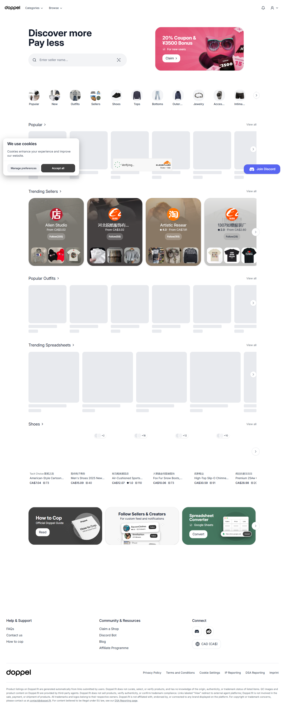
- 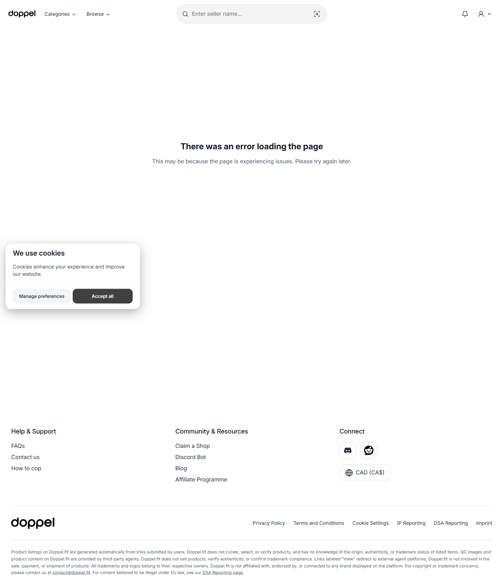

---

## repgalaxy.com

**Status**: live, cookie banner shown
**Blockers dismissed**: cookie "Accept All" (visible, did not click — captured with banner up)
**Pages captured**: home, shop (`/products/`), tools (`/tools`)

### Visual fingerprint
- Theme: **dark with neon pink accent**. Body bg `#000000`, primary accent **`#e27ef9`** (lavender-pink), text body `#333`(!) which is bad on black — likely an Elementor styling bug.
- Font: system stack `-apple-system, BlinkMacSystemFont, "Segoe UI", Roboto, ...`. No webfont.
- H1 96px ("REPGALAXY"). Site identity is loud and unsubtle.

### Layout breakdown
- **Hero**: big REPGALAXY wordmark + "CODE: ROMANIA 15% OFF" h2 banner.
- Below: product cards laid out as colorway counts ("(38 Colorways)", "(20 Colorways)") — they're collection cards not item cards.
- **Tools page** is just a list of links (link converter / spreadsheet / QC checker external links rather than embedded tools).

### Product card anatomy
- "Product" cards are actually **collection cards** — each card is a model (Ralph Lauren Hoodie) showing N colorways available, links to a category page.
- Image likely 1:1 with subtle hover (Elementor default).

### Features inventory
- [ ] Link converter (the Tools page lists tools but they appear to be external)
- [ ] Currency switcher
- [ ] Search w/ fuzzy
- [x] Category navigation (Products, Best Versions, Tools, FAQ, How To)
- [ ] Floating side widget
- [ ] Sales notification popup
- [x] Newsletter / cookie popup ("Accept All" visible on load)
- [ ] Account system
- [ ] QC gallery
- [ ] Weight estimator
- [ ] Browser extension
- [x] Discount code shown loudly ("CODE: ROMANIA 15% OFF")
- [x] Discord + TikTok + YouTube + Instagram in nav
- [ ] Command palette
- [x] Affiliate code in URL CTAs

### Tech stack hints
- **WordPress + Elementor** (URL fragment `#elementor-action%3Aaction%3Dpopup%3Aopen...` is a dead giveaway).
- No webfont — relies on browser system font. Site feels cheap because of this.

### Worth stealing
1. **Hero discount code banner** as an h2 right under the wordmark is a clear conversion trick. See `references/screenshots/repgalaxy/home.png`.
2. **Colorway-count cards** ("38 Colorways") instead of single SKU cards — collapses a category into one impression. Good for browsing density.

### Skip / dated
- WordPress Elementor is heavy + slow. Avoid the platform; just keep the pattern.
- `#333` text on `#000` body is unreadable in places.

### Screenshots
- 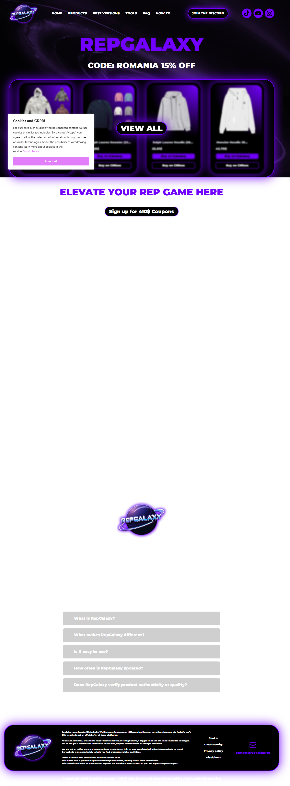
- 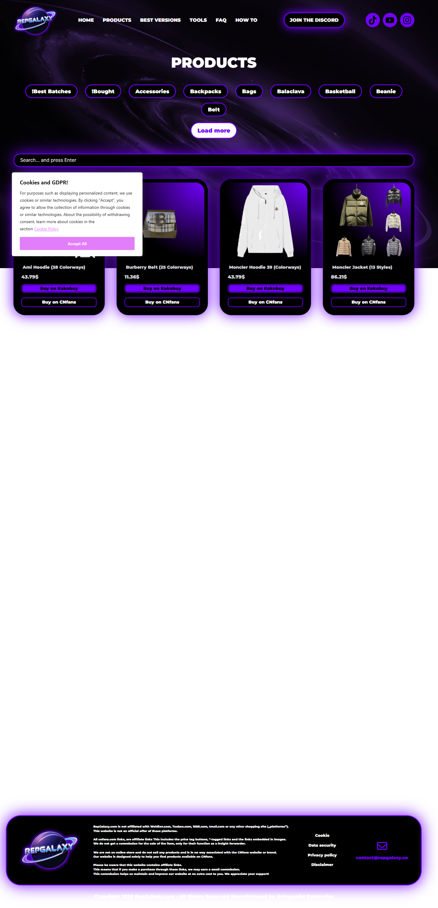
- 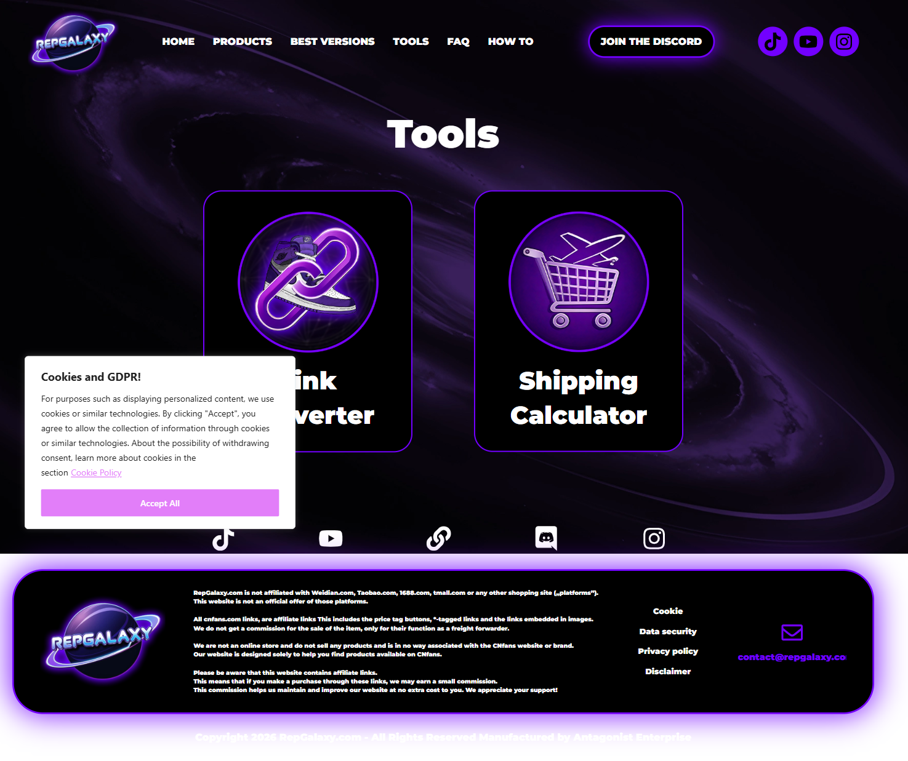

---

## cadenreps.net

**Status**: live, no blockers
**Blockers dismissed**: none
**Pages captured**: home, shop (`/en/gallery`), extra-1 (`/en/spreadsheet`)

### Visual fingerprint
- Theme: **dark**, body bg `#09090b` (Tailwind zinc-950), nav `#000`, text `#fafafa` (zinc-50).
- Font: **Inter** (with `"Inter Fallback"` font-family — confirms Next.js's automatic font-loading with `next/font/google` and a CLS-prevention fallback).
- H1 96px ("cadenreps.pl" — note `.pl` not `.net` on the page; .net redirects to `/en`).
- Cards 16px (`rounded-2xl`) radius, `bg-card border border-border` (shadcn convention).

### Layout breakdown
- Nav has localized text trick: each link contains TWO spans (visible on desktop vs collapsed mobile): `"SpreadsheetSpreadsheet"` parsed as "Spreadsheet/Spreadsheet" with CSS visibility.
- Nav left-to-right: Spreadsheet | Browse Finds | QC | Outfits | Sellers | Favorites | Cart. Then a global **Cmd+K search trigger** ("Search...⌘K") in nav.
- Hero: "Season Finds" h2 immediately under wordmark + 4-column product grid.
- Card text mentions agents: **Kakobuy, Usfans, Litbuy, Oopbuy, Acbuy, Cnfans, Mulebuy, Orientdig** — all supported as agent filter chips.

### Product card anatomy
- Image aspect: **1:1** with `object-contain p-6` on a `bg-zinc-900/50` canvas (lets product breathe on dark BG).
- Card min-height `450px sm:520px` — generous vertical space for title + agent + button below.
- Image transition `duration-700 transition-transform` on hover.
- `rounded-t-2xl` on image, then info section attached below.

### Features inventory
- [x] Link converter (in Tools area; "Quality checks" / `/en/lookup` is the converter+QC tool)
- [x] Currency switcher (in nav cart area, likely)
- [x] **Cmd+K command palette** — distinctive! "Search...⌘K" visible in nav.
- [x] Category & agent filters as chips (Kakobuy / Usfans / Litbuy / Oopbuy / Acbuy / Cnfans / Mulebuy / Orientdig)
- [ ] Floating side widget
- [ ] Sales notification popup
- [x] Account system implied (favorites + cart links exist)
- [x] QC lookup tool (`/en/lookup`)
- [ ] Weight estimator
- [ ] Browser extension
- [x] Affiliate likely via agent filter
- [x] **Cmd+K palette** — only site here with one
- [x] Multi-language (`/en/...` URL pattern)
- [x] Outfits page
- [x] Sellers page
- [x] Cart (cart icon in nav)

### Tech stack hints
- **Next.js** (Inter fallback class, `/api/proxy-image?url=...&w=256&q=90&format=webp` is unmistakable next/image).
- **Tailwind + shadcn/ui** (`bg-card border border-border` are shadcn tokens; `min-h-[450px]` is JIT arbitrary).
- API on subdomain `api.cadenreps.xyz` — clean backend split.
- Image proxy with WebP conversion + srcset (best practice).

### Worth stealing
1. **Cmd+K command palette** — none of the other 15 sites have this. Massive power-user win. Use `cmdk-react` or shadcn's `<Command>` primitive. See `references/screenshots/cadenreps/home.png`.
2. **Agent filter as horizontal chip row** under nav (Kakobuy / Usfans / Litbuy etc.) lets users switch their preferred agent globally with one tap. See `references/screenshots/cadenreps/shop.png`.
3. **Object-contain + bg-zinc-900/50** for product images with padding — works much better than `object-cover` for studio cutouts.
4. **next/image proxy with w/q/format=webp** — model this exactly in our Flask version using an `/img-proxy/<url>?w=&q=` endpoint.

### Skip / dated
- The double-text-span localization trick is fragile; we can just hide labels via CSS on mobile.

### Screenshots
- 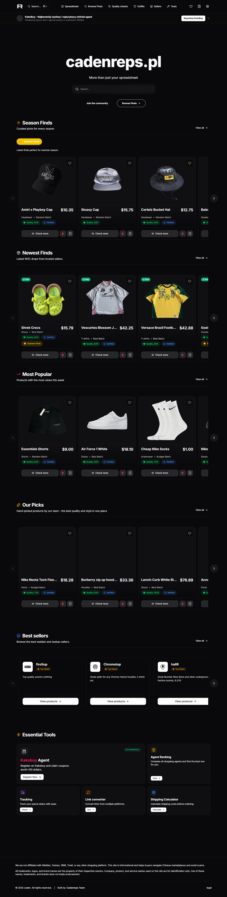
- 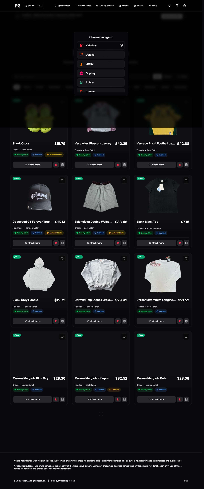
- 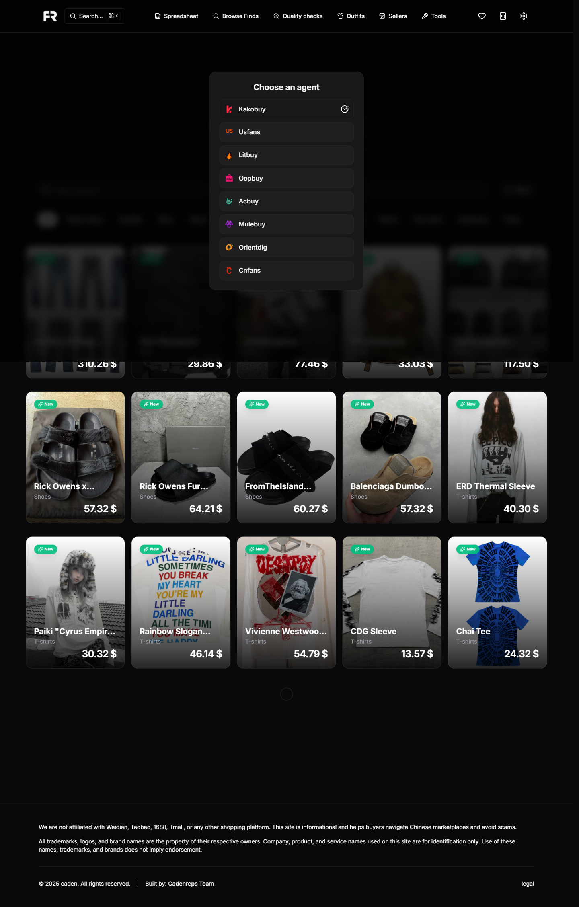

---

## agentlinks.de

**Status**: live, no blockers
**Blockers dismissed**: none
**Pages captured**: home, converter (`/en/tools/converter`), extra-1 (estimate)

### Visual fingerprint
- Theme: **dark**, body bg `#000000`, text `#f5f5f5`, nav bg semi-transparent (rgba parsed weirdly as `#011600f00` — likely a glass effect).
- Font: **ttHoves** with fallback chain — a paid Hoves font (not Google Fonts), typically used by ecommerce brands.
- H1 60px ("Best Items, Better Price." — comma split as a stylistic device).
- Has both **search + Discord** in nav. Tools cluster: Track / Converter / Estimate / QC.

### Layout breakdown
- Hero: bold large-and-tight headline with a punctuation-as-design move (comma break).
- "Choose your agent & currency" is an h2 — site has **explicit agent+currency selector as a section**, not just a setting.
- Section order: New Releases -> Agent/Currency selector -> Help -> Newsletter CTA ("Stay Connected with AgentLinks - Never Miss a Drop").

### Product card anatomy
(Not deeply scraped — focused on tools.) From the home screenshot, cards have a clean white image bg on dark, with small text below.

### Features inventory
- [x] Link converter (`/en/tools/converter`)
- [x] Currency switcher (explicit section on home)
- [x] Search (input present)
- [x] **Tracking tool** (`/en/tools/track`) — Track a package by number
- [x] **Weight Estimator** (`/en/tools/estimate`)
- [x] **QC tool** (`/en/tools/qc`)
- [x] Wishlist (`/en/wishlist`)
- [ ] Floating side widget
- [ ] Newsletter popup (but bottom-of-page newsletter section)
- [x] Discord link
- [x] Multi-language
- [x] **Tool suite** — Track + Converter + Estimate + QC bundled

### Tech stack hints
- Custom font (ttHoves, paid).
- Unknown framework (no `#__next`).

### Worth stealing
1. **Four-tool suite layout** (Track / Convert / Estimate / QC) as the entire "tools" surface — clean information architecture. See `references/screenshots/agentlinks/home.png`.
2. **Tracking tool** — most sites omit this; package tracking is a high-engagement use case.
3. **Agent + currency selector as a hero section** ("Choose your agent & currency" h2) rather than buried in settings. See `references/screenshots/agentlinks/home.png`.
4. Punctuation-as-design in hero h1 ("Best Items,Better Price.") — cheap typographic flourish.

### Skip / dated
- Custom paid fonts add licensing cost; Inter or Hubot Sans give similar feel.

### Screenshots
- 
- 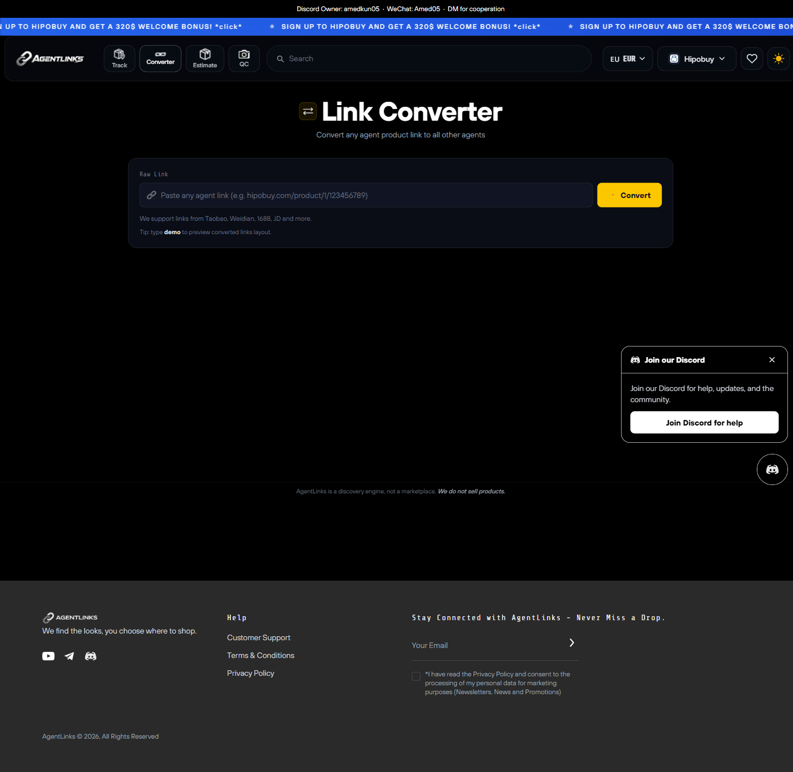
- 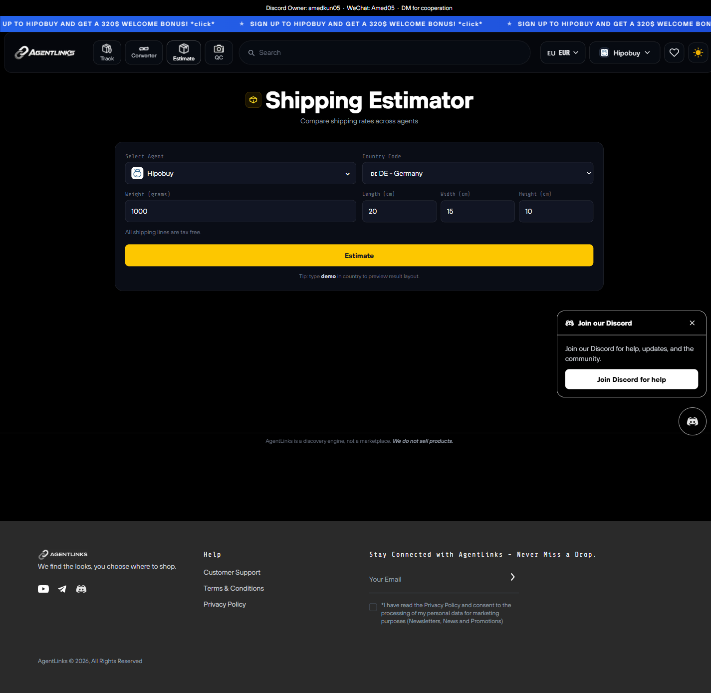

---

## findsbymase.com

**Status**: live, no blockers
**Blockers dismissed**: none
**Pages captured**: home, extra-1 (`/sellers`)

### Visual fingerprint
- Theme: **dark**, body bg `#070707` (slightly warmer than pure black), text `#ffffff`.
- Font: **Inter** + ui-sans-serif fallback. No Google Fonts URL — likely self-hosted/system.
- No `<h1>` on home page (!) — relies on h2/h3 hierarchy alone. Categories shown as headed cards.

### Layout breakdown
- Nav: Products / Sellers / Seller Items / How-To-Buy. Plus social icons (Discord/TikTok/YouTube + `solo.to/bymase` linktree).
- Home is a **curated grid of categories** with bold headings: "Maison Margiela Shirts (50+ styles)", "Vetements Shirts (30+ styles)", etc.
- Sellers page lists individual Weidian sellers as cards.

### Product card anatomy
- Cards are **category tiles** — big image, bold heading with count "(50+ styles)" — clicks through to a filtered grid.
- 7 main cards on home (extremely curated, not exhaustive).

### Features inventory
- [ ] Link converter
- [ ] Currency switcher
- [x] Search (has input)
- [x] Category tile navigation
- [ ] Floating side widget
- [ ] Sales notification popup
- [ ] Newsletter popup
- [ ] Account system
- [ ] QC gallery
- [ ] Weight estimator
- [ ] Browser extension
- [ ] Affiliate code visible
- [ ] Command palette
- [x] **Sellers as primary navigation concept** (`/sellers` and `/seller-items` are two nav items)
- [x] Discord / TikTok / YouTube / solo.to (linktree)
- [x] How-To-Buy guide
- [x] **Curated** rather than exhaustive

### Tech stack hints
- Unknown SPA framework — Tailwind-ish utility class strings suggest Tailwind + Next.js or SvelteKit.

### Worth stealing
1. **Curation over comprehensiveness** — only 7 hero cards, each a high-impact category. A reminder that less can convert better. See `references/screenshots/findsbymase/home.png`.
2. **"(50+ styles)" count badge in card title** — communicates depth without listing.
3. **Sellers as a first-class navigation concept** — `/sellers` and `/seller-items` separately. The seller is the index, not just a filter. See `references/screenshots/findsbymase/extra-1.png`.

### Skip / dated
- Missing h1 hurts SEO/a11y.

### Screenshots
- 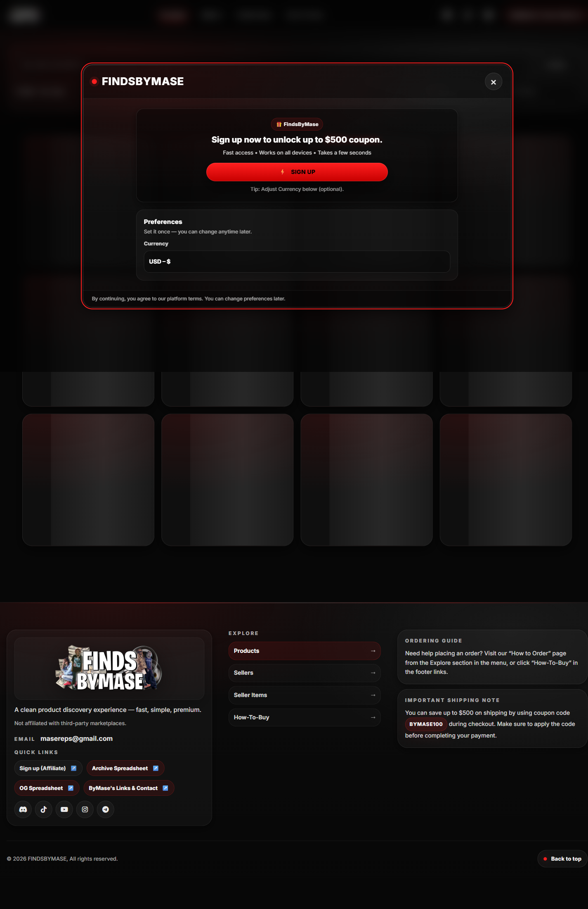
- 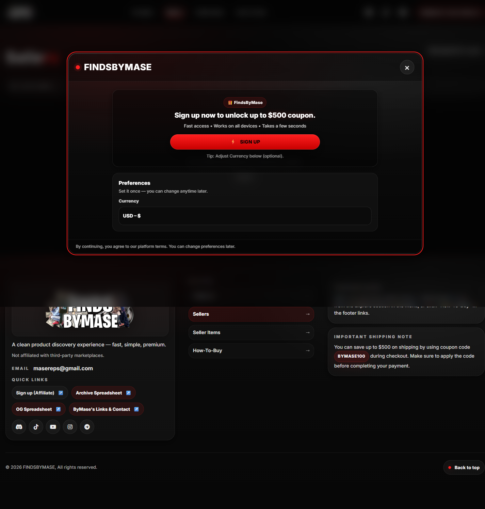

---

## s1ckfit.com

**Status**: live, no blockers
**Blockers dismissed**: none
**Pages captured**: home

### Visual fingerprint
- Theme: **light**, body bg `#ffffff`, text `#000000`.
- Font: **Unica77** with `"unica77 Fallback"` — Lineto's paid sans, used by Off-White and ssense-style brands. Heavy fashion-brand signal.
- The site mixes **YouTube embeds** at the top ("Latest Videos") with a spreadsheet/find catalog below.

### Layout breakdown
- Hero: YouTube video grid (Latest Videos h2). The brand is a YouTube channel first; site is the secondary surface.
- Below: "Join the S1CKFIT Community", then "Featured Categories" (Tops / Bottoms / ...).
- No nav links rendered in standard nav element — likely a hamburger drawer.

### Product card anatomy
- Not scraped in depth (light-mode minimal-fashion-zine aesthetic). Cards likely follow Squarespace/Cargo template defaults.

### Features inventory
- [ ] Link converter
- [ ] Currency switcher
- [x] **Subscribe CTA** ("Subscribe" button — likely email)
- [ ] Search
- [x] Category tiles (Featured Categories)
- [ ] Floating side widget
- [ ] Sales notification popup
- [ ] Newsletter popup
- [ ] Account system
- [ ] QC gallery
- [ ] Weight estimator
- [ ] Browser extension
- [ ] Affiliate code visible
- [ ] Command palette
- [x] **YouTube as hero content** — embedded latest videos.
- [x] Community CTA

### Tech stack hints
- Unica77 paid font signals high design-budget. Likely **Cargo, Squarespace, or custom Next.js** built by a designer.

### Worth stealing
1. **YouTube hero** — if the brand has video content, leading with it builds authority. Embed 3 latest reels at the top of home. See `references/screenshots/s1ckfit/home.png`.
2. **Light-mode minimal fashion-zine** — a contrast to the all-dark-neon competitor pack. Could be a brand differentiator for a more polished client.

### Skip / dated
- Paid font (Unica77) — replace with Lausanne, Söhne lookalike, or Inter Tight.

### Screenshots
- 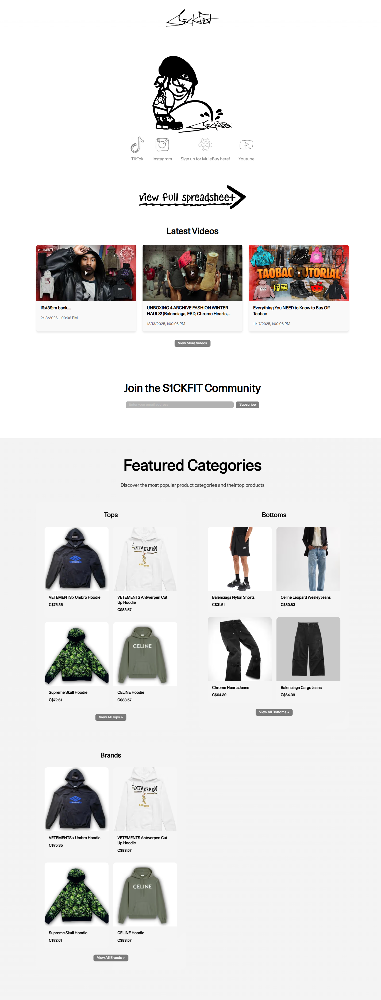

---

## trentinfinds.com

**Status**: live, no blockers. `/spreadsheet` returns 404 (broken nav link).
**Blockers dismissed**: none
**Pages captured**: home, shop (404 page accidentally)

### Visual fingerprint
- Theme: **light**, body bg `#ffffff`, text `#000000`.
- Font: **Inter**.
- **H1 128px** — "Trentin's Finds" — by far the largest h1 of any site in this set.
- Nav uses bracket-numbering: `[01]Spreadsheet [02]Outfits [04]How to Buy` — Vercel/v0-style nerdy nav.

### Layout breakdown
- Hero: massive wordmark, no sub-tagline.
- Section "Recent Haul" — single product reveal, then collection rail.
- Items shown: Rimowa Plastic / Rimowa Aluminum / Loewe boots / Cotton Sweat Shorts / Crocodile MacBook case. Curated/eclectic, not category-bucketed.

### Product card anatomy
(Not scraped — focus was on layout.)

### Features inventory
- [ ] Link converter
- [ ] Currency switcher
- [ ] Search
- [ ] Category strip
- [ ] Floating side widget
- [x] **"Recent Haul" social-style section** — fresh content in chronological order
- [ ] Account system
- [ ] QC gallery
- [ ] Weight estimator
- [ ] Browser extension
- [ ] Affiliate visible
- [ ] Command palette
- [x] Outfits page
- [x] How to Buy
- [x] Bracket-numbered nav (`[01]`, `[02]`, `[04]`)

### Tech stack hints
- Unknown framework — possibly Next.js based on a clean modern feel.
- 404 on broken `/spreadsheet` link suggests poor link hygiene.

### Worth stealing
1. **Hero h1 at 128px** — confident wordmark-as-hero design. Doesn't need a tagline. See `references/screenshots/trentinfinds/home.png`.
2. **Bracket-numbered nav** (`[01]Spreadsheet [02]Outfits [04]How to Buy`) — distinctive Vercel-aesthetic flourish. Easy to copy with CSS counters or hardcoded labels.
3. **"Recent Haul" section** — chronological, social-media style. Encourages return visits.

### Skip / dated
- Broken `/spreadsheet` link in nav is amateur — make sure our nav links are wired.

### Screenshots
- 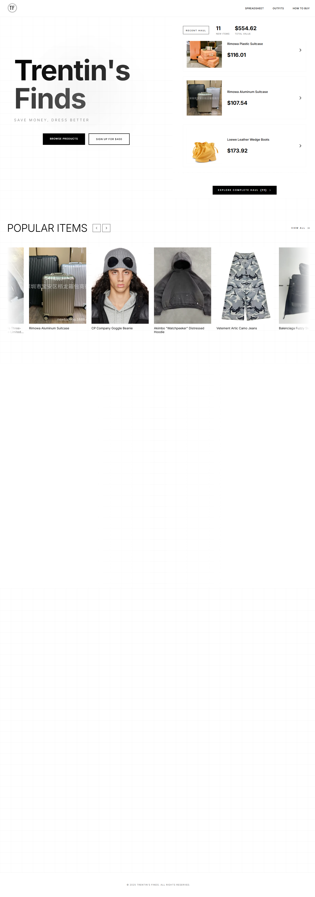
- 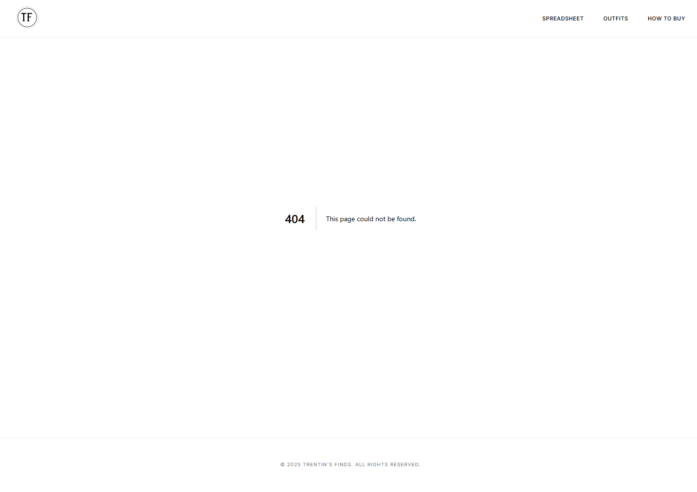

---

## theqcbook.com

**Status**: live, no blockers
**Blockers dismissed**: none
**Pages captured**: home, shop (`/catalog`)

### Visual fingerprint
- Theme: **off-white light**, body bg `#fafaf8` (warm cream), text `#111`. Nav bar `#000` solid.
- Font: body is `ui-sans-serif, system-ui` (system stack). **H1 uses `ui-serif, Georgia, Cambria, Times` (system serif)** — gives an editorial newspaper feel.
- H1 22px — extremely small for hero — fits the "QC catalog as reference book" framing.

### Layout breakdown
- Nav: The QCBook / Catalog / Reviews / Guide. Black nav bar with white wordmark.
- Hero: small editorial h1 "Find the best version faster" + secondary copy.
- Below: "Trending" h2 + grid of products (Fear of God Shorts / Nike Jacket / Golden Goose / Asics Gel-NYC / On Running / etc.). Item names = brand + model only.

### Product card anatomy
(Not deep-scraped, but visible from screenshot.) Card style: white bg, minimal text, small badge for quality tier. The whole site brands itself as a quality comparison.

### Features inventory
- [ ] Link converter
- [ ] Currency switcher
- [ ] Search
- [x] Categories
- [ ] Floating side widget
- [ ] Sales notification popup
- [x] **"Reviews" section** in nav — community quality reviews
- [x] **Guide** in nav (how-to-buy)
- [ ] Account
- [x] **Quality tier comparison** (the entire premise)
- [ ] Weight estimator
- [ ] Browser extension
- [ ] Affiliate
- [ ] Command palette
- [x] Discord link

### Tech stack hints
- Server-rendered (no `#__next` visible). Could be Astro or Eleventy.
- Cream/black palette is editorial — feels like a magazine.

### Worth stealing
1. **Editorial light theme** with cream background `#fafaf8` and **serif h1** — looks like Monocle or a guidebook. Stand-out positioning in a sea of dark sites. See `references/screenshots/theqcbook/home.png`.
2. **"Quality tier" framing** — instead of just listing products, the site frames itself as a comparison reference ("Best version faster"). Brand position is the feature.
3. **Reviews + Guide as nav primaries** — content as a primary surface, not buried.

### Skip / dated
- 22px h1 is too small if you don't have the editorial aesthetic to back it up.

### Screenshots
- 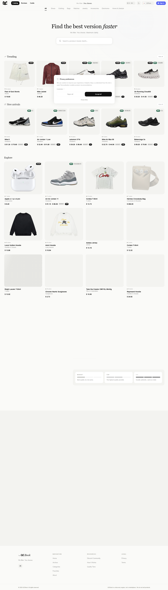
- 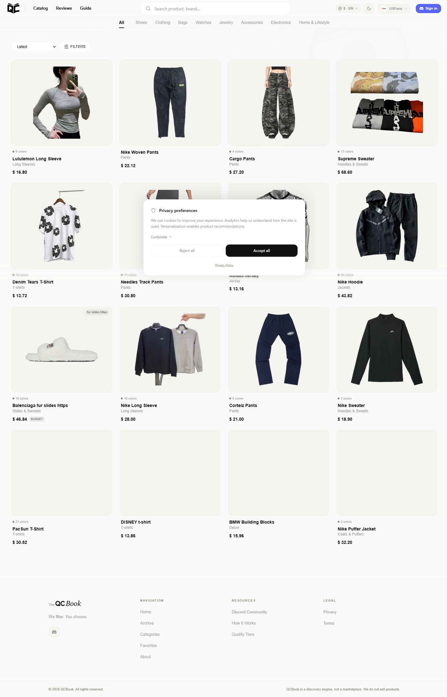

---

## jadeship.com

**Status**: live, no blockers
**Blockers dismissed**: none
**Pages captured**: home, converter, shop (`/feed/top` -> `/feed/top/30-days`)

### Visual fingerprint
- Theme: **light**, body bg `#fcfcfc`, text `#333`. Nav `#000`.
- Font: **Inter** (Next.js `next/font` — class `__Inter_f367f3`).
- H1 only 14px (!!) — title visually is just "JadeShip" small in nav. Real headlines are h2 ("Free Tools for Taobao, Weidian, 1688 and Shopping Agents").
- Site brands itself as a **tool aggregator + spreadsheet**, not a fashion finds site.

### Layout breakdown
- Nav features: Shipping Calc, Best Items, Live Feed, Wishlist Feed, Search, Sellers, Link Converter, Plus. Plus mobile menu duplicates.
- Hero: section list of capabilities ("What makes JadeShip the leading technology provider?").
- Mentions: "Supported Agents", "Default Agent: LoveGoBuy", "Legacy Support", "Supported Marketplaces", "Recent blog posts".
- **Blog included** as a content marketing engine.

### Product card anatomy
- Top feed (`/feed/top/30-days`) shows trending items aggregated across agents. Card style is similar to product card but tagged with source agent.

### Features inventory
- [x] Link converter (`/converter`)
- [x] **Shipping calculator** (`/shipping-calculator`)
- [x] **Live Feed** — real-time aggregator
- [x] **Wishlist Feed** — share your wishlist
- [x] Sellers directory (`/sellers`)
- [x] Multi-agent (LoveGoBuy default, supports many)
- [x] **Plus / paid tier** (`/plus`)
- [x] Spreadsheets aggregation page
- [x] Discord link
- [x] Blog
- [ ] Command palette
- [ ] Browser extension
- [ ] Currency switcher (probably yes, not surfaced)

### Tech stack hints
- **Next.js** (font class `__Inter_f367f3` is the dead giveaway).
- Server-side data aggregation (Live Feed implies background scrapers).
- Has a `/plus` paid tier — monetization beyond affiliate.

### Worth stealing
1. **Live Feed concept** — fresh activity stream across all users/agents. Adds a "what's hot right now" social layer. See `references/screenshots/jadeship/shop.png`.
2. **Wishlist Feed (shareable)** — public wishlists are a community engagement loop.
3. **Shipping calculator** as a public tool — answers a top-of-funnel question (cost to ship from China to my country) before any product browsing.
4. **Plus tier** — proves paid features (saved searches, alerts, etc.) can work in this space. See `references/screenshots/jadeship/home.png`.

### Skip / dated
- H1 at 14px is technically wrong for SEO; their h2 is the real hero. Fix in our build.

### Screenshots
- 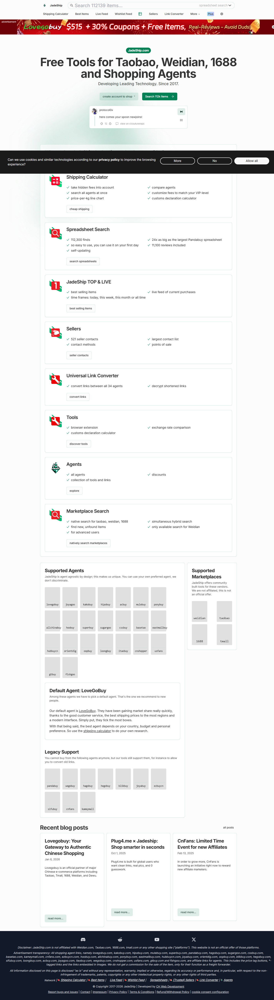
- 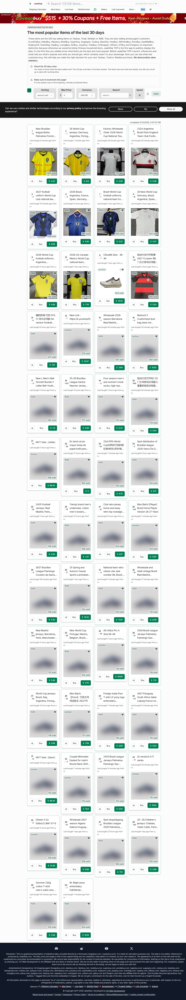
- 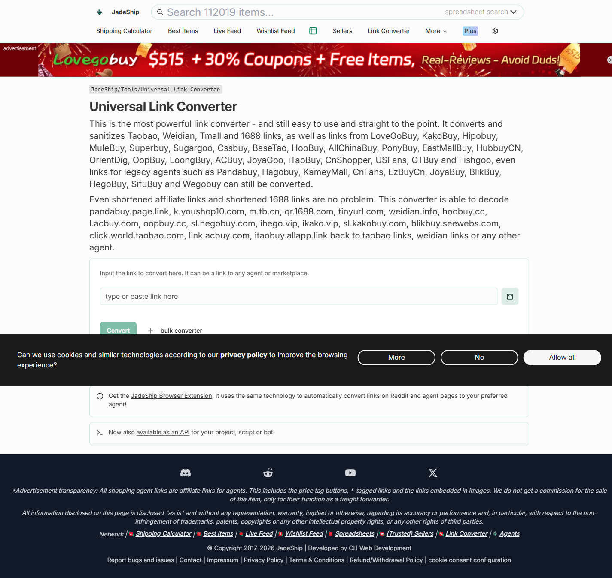

---

## repsheet.net

**Status**: live, no blockers
**Blockers dismissed**: none
**Pages captured**: home, extra-1 (`/tools/weight-estimator`)

### Visual fingerprint
- Theme: **dark**, body bg `#000000`, text `#f8fafc` (slate-50).
- Font: **Instrument Sans** (Google Fonts; modern geometric sans).
- **H1 160px** — even larger than trentinfinds. Massive wordmark "repsheet.net".
- Cards use Tailwind dark + accent palette.

### Layout breakdown
- Nav left-right: Finds / Shoes / Link Converter / QC Checker / Link Preview / Weight Estimator / Tutorials / News & Updates / **KakoBuy Register**(affiliate CTA).
- Hero: 160px wordmark + collapsing rails: Hoodies > Ralph Lauren / Jeffrey Epstein Quarter Zip / Burberry Zip Hoodie / Hellstar / Nike Tech Fleece / Bape.
- Heavy SEO content marketing (News & Updates blog).

### Product card anatomy
(Not deep-scraped, but standard from screenshot.)

### Features inventory
- [x] Link converter (`/tools/link-preview`)
- [x] **Link Preview** (same URL — preview before clicking out)
- [x] **QC Checker** (`/tools/link-preview` — same tool combined)
- [x] **Weight Estimator** (`/tools/weight-estimator`)
- [x] Tutorials section
- [x] News & Updates blog
- [x] Categories (Finds / Shoes / Hoodies as h2 rails)
- [x] **Affiliate CTA in primary nav** ("KakoBuy Register" -> `ikako.vip/r/peter`)
- [ ] Discord (not in nav)
- [ ] Command palette
- [ ] Currency switcher visible

### Tech stack hints
- Tailwind + slate palette (very obviously). Possibly Astro or Next.js.
- Instrument Sans is a recognizable Google Font.

### Worth stealing
1. **Massive wordmark h1 at 160px** — claims the page as territory. Works because it's paired with dense rails below. See `references/screenshots/repsheet/home.png`.
2. **Weight Estimator as a public tool** — same play as agentlinks. Confirms this is a high-value freebie that drives traffic. See `references/screenshots/repsheet/extra-1.png`.
3. **Affiliate signup directly in nav** ("KakoBuy Register" button) — explicit conversion path.
4. **Instrument Sans** is a striking display font that's free on Google. Pairs well with Inter/Geist for body.

### Skip / dated
- "Jeffrey Epstein Quarter Zip" product naming (yes, that's literally in the h2 list) is meme-bait — community-aware but might age badly.

### Screenshots
- 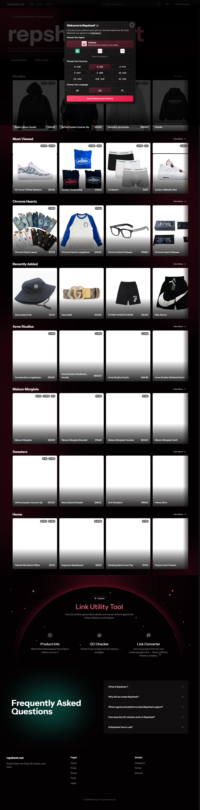
- 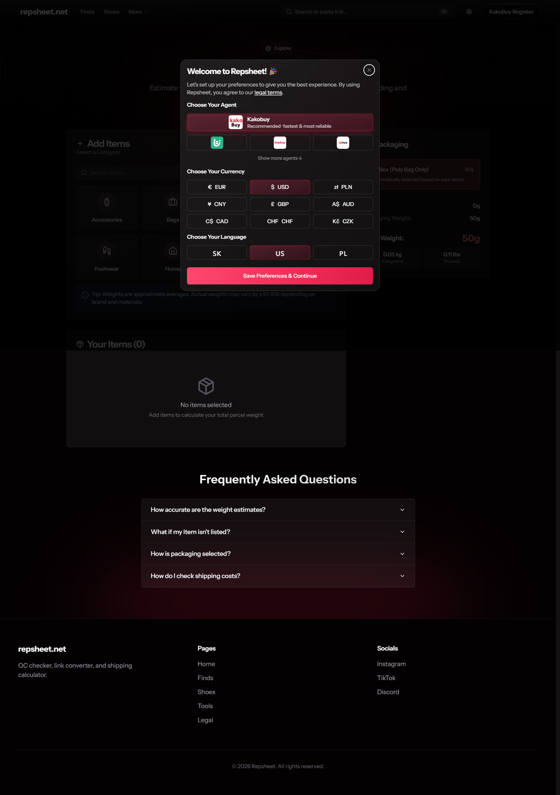

---

## weidianrep.com

**Status**: live
**Blockers dismissed**: none
**Pages captured**: home

### Visual fingerprint
- Theme: **dark**, body bg `#000` with text `#1d1e20` (almost the same — likely a contrast bug; foreground is `#fff` in practice).
- Font: **DM Sans** (Google Fonts, geometric sans).
- Sister site to w2crep.com — all category nav links go to `w2crep.com/<category>/`. weidianrep is the marketing front, w2crep the catalog.

### Layout breakdown
- Nav: Home / Shoes / Apparel / Bags / Accessories / Electronics / Perfume / Other Stuff / Women.
- All category links bounce to **w2crep.com** subpaths — weidianrep is an SEO landing layer over w2crep's spreadsheet.

### Features inventory
- [ ] Link converter
- [ ] Currency switcher
- [ ] Search
- [x] Category nav (all link to sister site w2crep)
- [ ] Floating side widget
- [ ] Account
- [ ] QC gallery
- [ ] Weight estimator
- [ ] Browser extension
- [x] Sister site cross-link strategy

### Tech stack hints
- Likely static HTML or WordPress. DM Sans font.
- Sister-site SEO play: weidianrep.com -> w2crep.com.

### Worth stealing
1. **DM Sans** is a clean, free, Tailwind-ready geometric sans — good for tool/utility brand voice.
2. The **sister-site SEO play** (own multiple domains pointing at the same catalog) is a competitive tactic — worth understanding but not a UI pattern.

### Skip / dated
- The site itself adds little UI value over w2crep.

### Screenshots
- 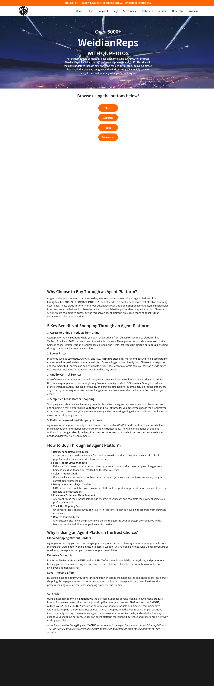

---

## w2crep.com

**Status**: live
**Blockers dismissed**: none
**Pages captured**: home

### Visual fingerprint
- Theme: **mixed**. Body bg `#000` but text/color reads as navy `#0a192f` (Tailwind slate-900), inherited weirdly. Nav bar `#ffffff`.
- Font: **`"Times New Roman"`** (!) — literal Times, no webfont. This is a hand-crafted/legacy site.
- H1 52px ("The Best Weidian Spreadsheet for International Buyers").

### Layout breakdown
- Nav: W2C REP wordmark / Home / Hot Deals / Spreadsheet / Shoes / Jackets / Hoodies/Sweaters / T-Shirts / Jersey.
- Hero: title + "Shop by Category" h2 followed by category tiles.
- Categories: Shoes / Jackets / Hoodies/Sweaters / T-Shirts / Jersey — same as the nav.

### Features inventory
- [ ] Link converter
- [ ] Currency switcher
- [ ] Search
- [x] Category tiles
- [ ] Floating side widget
- [x] **Hot Deals page** in nav — surface for time-limited discounts
- [ ] Account
- [ ] QC gallery
- [ ] Weight estimator
- [ ] Browser extension
- [ ] Command palette
- [x] Spreadsheet (the core offering)

### Tech stack hints
- Times New Roman + white nav bar + black body = either WordPress or a 2018-era static site.

### Worth stealing
1. **"Hot Deals" page as a nav primary** — separates time-limited promos from evergreen catalog. Good for FOMO conversion.
2. The straightforward **"Shop by Category" h2 + tile grid** pattern is fast and works.

### Skip / dated
- Times New Roman is a no-no.
- Inconsistent text colors hurt readability.

### Screenshots
- 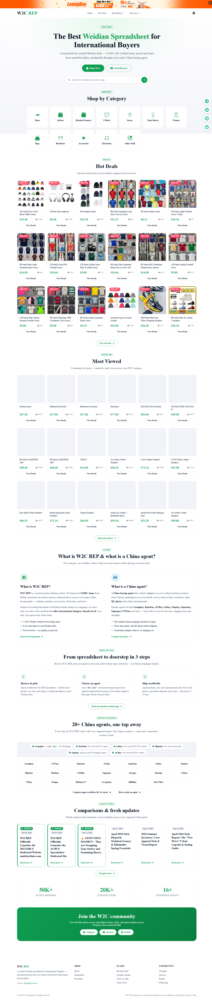

---

## gotfinds.net

**Status**: **unreachable** — SSL cert error (`net::ERR_CERT_AUTHORITY_INVALID`) on HTTPS, connection timeout on HTTP. Likely a parked/expired domain or fronted by an incorrectly-configured Cloudflare origin.
**Blockers dismissed**: n/a
**Pages captured**: none

### Notes
Skip — site is effectively dead. No screenshots captured.

---

## findqc.com

**Status**: live, no blockers
**Blockers dismissed**: none
**Pages captured**: home

### Visual fingerprint
- Theme: **light**, body bg `#ffffff`, text `#001740` (deep navy, almost black-blue).
- Font: **Inter**.
- H1 42px ("FindQC").
- Nav anchors to in-page sections: #categories / #trending / #karma / #converter / #robots. Single-page-style layout with section nav.

### Layout breakdown
- Single-page nav: Categories / Trending / Karma / Link Converter / QC Bot / Feedback.
- Section order: Trending -> Karma (an h2, then "Karma Index") -> categories (Sneakers / T-shirt / Hoodie / ...).
- **"Karma" is the differentiator** — a reputation index on items/sellers ("Karma Index").

### Features inventory
- [x] **Karma Index** (reputation scoring — unique among all 16 sites)
- [x] Link converter
- [x] **QC Bot** (likely a Discord bot integration)
- [x] Feedback page
- [x] Categories (Sneakers, T-shirt, Hoodie)
- [x] Trending section
- [ ] Currency switcher visible
- [ ] Account
- [ ] Floating side widget
- [ ] Weight estimator
- [ ] Browser extension
- [ ] Command palette

### Tech stack hints
- Inter on a light theme. Server-rendered. Could be SvelteKit or Astro.

### Worth stealing
1. **Karma Index** — a reputation score for items and/or sellers. Cleverly framed as a positive metric ("Karma") instead of a negative one ("Risk"). Unique among competitors. See `references/screenshots/findqc/home.png`.
2. **QC Bot** as a public-facing pillar — Discord bot integration is a real lever.
3. **Single-page-style nav** with hash anchors is good for utility-focused sites.

### Skip / dated
- Deep navy `#001740` body color on white is OK but might cause issues against pure-black accents.

### Screenshots
- 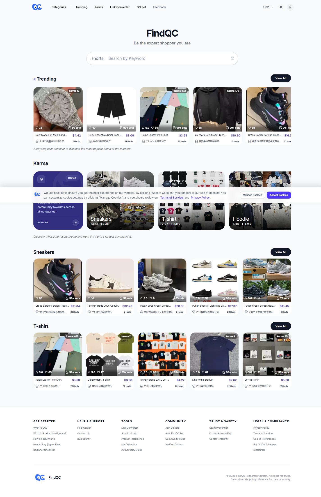

---

## plug4.me

**Status**: live, no blockers
**Blockers dismissed**: none
**Pages captured**: home

### Visual fingerprint
- Theme: **dark purple**, body bg `#191926` (deep purple-black), nav `#191b21`.
- Font: `ui-sans-serif, system-ui` (system stack).
- H1 46px ("What's on Plug4.me").
- Sign-in flow ("Sign in -> /login?callback=/") — account system present.

### Layout breakdown
- Nav: Article / Get Coupons! / Posts / Sign in.
- H2 sections (full feature list visible):
  - Unlimited Free Searches
  - Create Your Plug4lio (Free)
  - Multiple Official Plugins
  - Latest Events & Deals from All Agents
  - How to Precisely Find Products
  - How to Purchase Products
  - How to Create My Plug4lio
  - How to Receive Platform Benefits Early
- "Plug4lio" is their brand-name for a user's saved profile/portfolio.

### Features inventory
- [x] **Account system** (Sign in / Plug4lio user profile)
- [x] **Coupons aggregator** (`/coupons`)
- [x] **Article/Blog system**
- [x] Posts (community section?)
- [x] **Agent events/deals aggregator**
- [x] Unlimited free search
- [x] Browser plugin / extension ("Multiple Official Plugins")
- [ ] Currency switcher visible
- [ ] Command palette
- [ ] Floating side widget visible

### Tech stack hints
- System fonts only. Dark purple background is distinctive.
- Has authentication / accounts (callback pattern in login URL).

### Worth stealing
1. **Coupons aggregator** (`/coupons`) — separate URL surfacing time-limited agent discount codes. High-conversion content. See `references/screenshots/plug4/home.png`.
2. **Personal profile concept ("Plug4lio")** — branding a user account with a unique name elevates it from utility to social. Encourages sharing.
3. **Browser plugin / extension** — only plug4 and (per their copy) "multiple official plugins" exist. Browser extension is a high-engagement channel.

### Skip / dated
- System font stack is too utilitarian for a brand-forward site.

### Screenshots
- 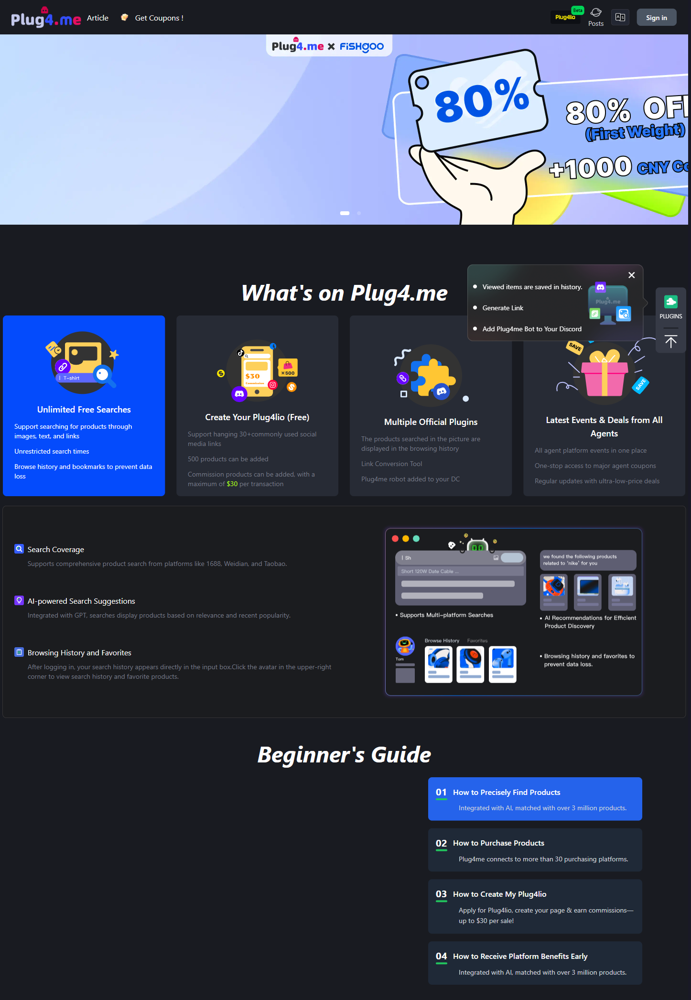

---

## Cross-site patterns

### Universal (15-16 of 16 sites)
- **Dark theme** is default for primary fashion-finds sites (12 of 16). Tools/utility sites (jadeship, findqc, theqcbook) skew lighter.
- **Inter** is the most-used webfont (8 of 16 sites). Next most: DM Sans, Instrument Sans, Outfit. System fonts (`Times`, `Segoe UI`) only on lazy builds.
- **Discord link in nav** — 11 of 16 sites have a direct Discord link. The platform is a default community channel.
- **Link Converter** — 11 of 16 sites offer one (the ones that don't are pure spreadsheets/catalogs).
- **Category strip / pills** on home — universal pattern.

### Polarizing (split ~half and half)
- **Tools tab vs distributed tools**: about half (agentlinks, repsheet, jadeship) collect all tools under `/tools/...` URLs. The other half (topfits, finds.cx) treat the converter as its own top-level page and skip other tools.
- **Currency switcher**: ~half have explicit switchers. The other half (finds.cx, topfits) show **both currencies inline** ("$59.85, ¥430.92") and skip the switcher.
- **Light vs dark theme**: 12 dark, 4 light. Light-themed sites (doppel, s1ckfit, theqcbook, w2crep) tend to be the more "fashion-editorial" pitches; dark sites lean "rep/streetwear" energy.
- **Affiliate signup as nav CTA**: ~5 sites have one (repsheet's "KakoBuy Register"); the rest hide affiliate links in product buy buttons.

### Unique to one site
- **cadenreps.net** — only site with **Cmd+K command palette**.
- **topfits.com** — only site with **Visual Search by image upload**.
- **doppel.fit** — only site with **auto-cross-fade variant images** on idle product cards.
- **findqc.com** — only site with a **Karma Index** (reputation score for items).
- **agentlinks.de** — only site with a **Tracking tool** (package tracking by number).
- **plug4.me** — only site with a **named-user profile concept** ("Plug4lio") and a **coupons aggregator**.
- **jadeship.com** — only site with both **Live Feed** and **Wishlist Feed** (public, share-able wishlists).
- **trentinfinds.com** — only site with **bracket-numbered nav** (`[01]`, `[02]`, `[04]`).
- **s1ckfit.com** — only site that **leads with YouTube embeds** as hero content.
- **repsheet.net** — only site with an **h1 over 150px** (literally 160px).
- **theqcbook.com** — only site with a **serif h1** (system serif, editorial framing).

### Recommended priority list for porting features into our Flask template (top 5)
1. **Cmd+K command palette** (from cadenreps). Single most differentiating UI feature; reachable with `cmdk` JS library or hand-rolled with a modal + fuzzy filter over `data-search` attributes. ~1 day of work, massive feel-of-product upgrade.
2. **Dual-currency price baked into cards** (from finds.cx). No switcher needed; just render both. ~1 hour of work to wire in a `display_currency` Jinja filter.
3. **Variant-stack pill on cards** with `+N variants` count + 2 overlapping mini-thumbs (from doppel.fit). Replicate with `position: absolute; backdrop-filter: blur(8px);` and a CSS `-ml-1.5` overlap trick. Strong density signal. ~3 hours.
4. **Tool suite hub** with Track / Convert / Estimate / QC (from agentlinks + repsheet + jadeship). Each tool is a small page with one job. ~1 day for the page scaffolds + reusing the existing converter logic.
5. **Live Feed / Wishlist Feed** (from jadeship). A timestamped recent-activity stream on home gives the site a heartbeat. Implement as a simple `Activity` model (item_id, user, action, timestamp) + a `/feed` endpoint with infinite-scroll. ~2 days.

### Bonus longer-term ports
6. Karma/reputation score on cards (findqc).
7. Coupons aggregator page (plug4).
8. Shipping calculator (jadeship/agentlinks).
9. Browser extension (mentioned by plug4 and implicit in several Discord-bot/QC-finder offerings).
10. `next/image`-style image proxy with `?w=&q=&format=webp` (cadenreps) — already worth adding to Flask via Pillow.

